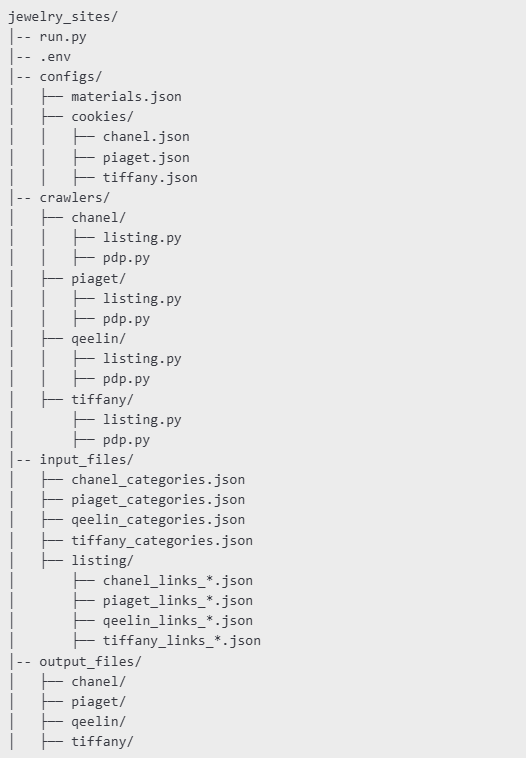

<<<<<<< HEAD
# jewellery_sites_extraction
=======
# Project Overview

This project is a web scraper designed to collect product data from various jewelry brand websites. It extracts listing pages and product details, storing them in structured JSON and Excel formats.

- **`Directory Structure`**:

# File Explanations

**Main Files** :
- **`run.py`**: - The entry point for running the scraper.
- **`.env`**: - Stores environment variables for authentication or configuration.

**Configuration Files** :
- **`configs/materials.json`**: - Contains metadata about materials used in jewelry.
- **`configs/cookies/`**: - Stores cookies for authentication on brand websites.

**Crawlers** :
- **`crawlers/*/listing.py`**: - Scrapes product listing pages.
- **`crawlers/*/pdp.py`**: - Scrapes individual product detail pages.

**Input Files** :
- **`input_files/*_categories.json`**: - Contains category mappings for each brand.
   Place your input category links here in same format as described in file::

-**File** : `jewelry_sites\input_files\chanel_categories.json`

-**File** : `jewelry_sites\input_files\piaget_categories.json`

-**File** : `jewelry_sites\input_files\qeelin_categories.json`

-**File** : `jewelry_sites\input_files\tiffany_categories.json`

- **`input_files/listing/links.json`**: - Auto generated ,Lists URLs to scrape for each region.

**Output Files** :
- **`output_files//.json`**: - Scraped product data in JSON format.
- **`output_files//.xlsx`**: - Scraped product data in Excel format.

**Proxy Usage** :

To prevent blocking issues, a proxy service is used. The .env file should contain the proxy key obtained from Scrape.do.

## **`Proxy Configuration`:**

- Proxy key should be placed inside the `.env` file.
  - scrapedo_token = `<Place your key here>`

- Each domain's proxy usage will vary according to the category URL provided in the input files.
- Ensure that the correct proxy configurations are applied per brand and region to maintain scraping efficiency.

# Flow Of Execution

- `Ensure all dependencies are installed.`
- `Update the .env file with necessary authentication details..`
-  Run the scraper using:
   python run.py <PLATFORM> <REGION>
- EXAMPLE : `python run.py chanel us`
- EXAMPLE : `python run.py piaget au`
- EXAMPLE : `python run.py qeelin jp`
- EXAMPLE : `python run.py tiffany kr`
- `The extracted data will be saved in the output_files/ directory.`

# Flow Of Execution

# **Additional Notes**

- The modular project structure allows for easy expansion to accommodate new brands.
- Authentication cookies should be updated periodically in configs/cookies/ to avoid access issues.
- The scraper is optimized for performance and reliability, but occasional updates to website structures may require adjustments to the crawlers.
- **_`For further assistance, please contact the development team.`_**
>>>>>>> 92f5ef3 (initial changes)
